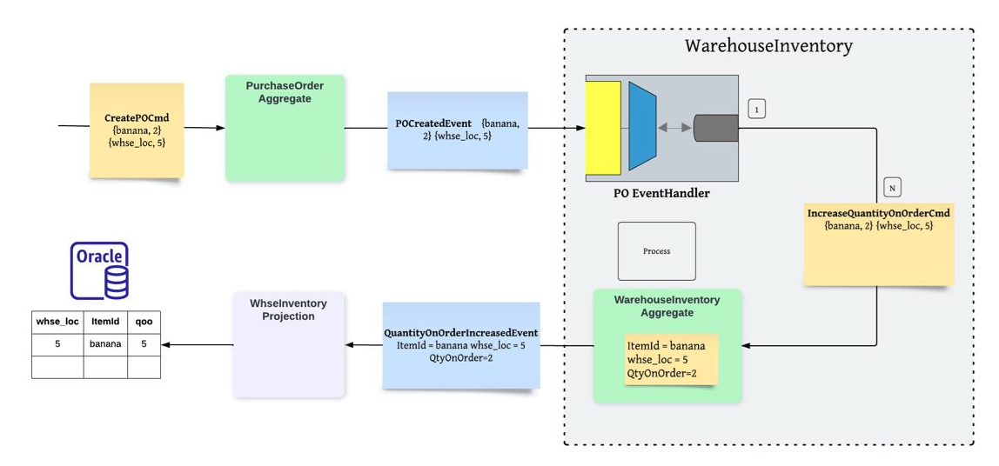
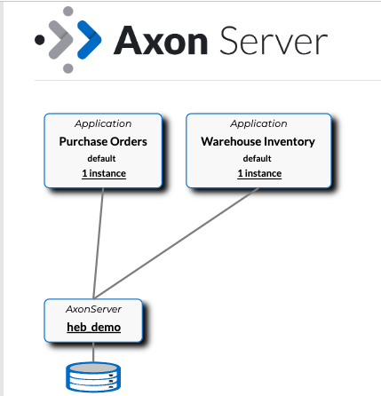

# Warehouse Inventory 
Handles PurchaseOrder event and Persists into warehouse inventory table.


## Set up Application Infra

#### 1. Start Axon Server by executing script in the main directory 
```
./start_axon_server.sh
```
Verify That Axon server is up in the container instance. Check  http://localhost:8024/#overview for GUI. 
#### 2. Start oracle instance by executing the below script
```
/start_oracle.sh
```
Wait for the Oracle database to be ready. Check container logs for more detail.

#### 3. Build and Publish PurchaseOrder
The WarehouseInventory uses some events from PurchaseOrder. It requires PO module to be published on the local repository. Use below command to publish PurchaseOrder events on local repository.
```shell
$ cd purchase-order
./gradlew publish
```
#### 4. Start PurchaseOrder Application
* Start `java/com/nashtech/purchseorders/PurchaseOrderApplication.java` in `purchase-order` directory. 
* Verify application is running and connecting to Axon server After a while. 

#### 5. Start WarehouseIventory Application
* Start `java/com/nashtech/whseinven/StrInvenCmdApplication.java` in `whse-inven` directory 
* Verify application is running and connecting to Axon server After a while.

#### 6. Verify both applications are connected Axon service on  http://localhost:8024/#overview


# Workflow
#### Create a Warehouse Inventory
* Run below POST call with <warehouseLocation> and <itemId> replaced.
```http://localhost:8081/createWhse/<warehouseLocation>/item/<itemId>``` e.g. Use `palatine` as location and `banana` as itemId.   

#### Create a PurchaseOrder 
Create a PurchaseOrder with same warehouse location with the following body and url
Method: POST  
URL: http://localhost:8080/createPo  
Body:  
```json
{
	"id": "p04",
	"lineItems":
	[
		{
			"itemId": "banana", 
		 "description": "Banana green", 
			"qty": 2}
	],
	"warehouseLocation": "palatine"
}	
```
### Note: Use unique id each time hitting the request. 

# Verify READ Model
### Connect to Oracle running on docker using any client using the below url: 
```shell
HostName: localhost
Port: 1521
Service Name: FREEPDB1
UserName: system
Password: password
```
Verify the read model for quantity on order in the whse_inven aggregate for quantity on order. 
```sql
select * from whse_inven;
```